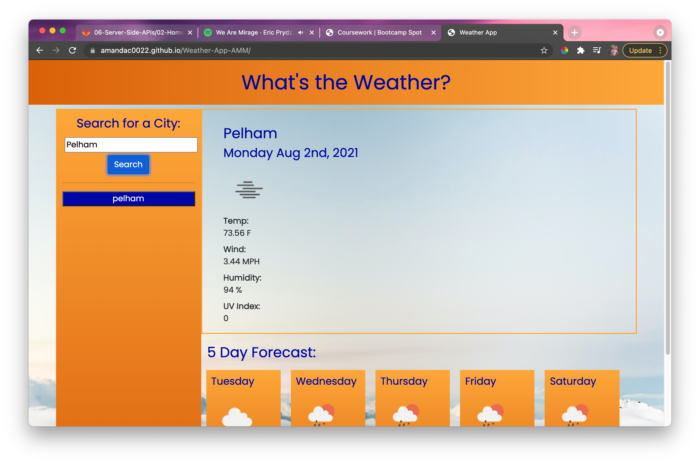

# Weather-App-AMM

## Description
This application allows the user to search for any city in the US. Once user clicks on the search button, it will load the current weather for that city as well as the next 5 days forecast. Once the user searches for the city, it will add the city to local storage and adds the city to the history. The user can click on different city buttons to display different cities' weather. 

## List of Technologies Used: 
- HTML 
- CSS
- Open Weather API
- JavaScript 
- Google Fonts 
- Giphy 
- Git 
- Markdown 
- GitHub 

## Link to Github Repo 
https://github.com/AmandaC0022/Weather-App-AMM/settings/pages

## Link to Deployed Webpage 
https://amandac0022.github.io/Weather-App-AMM/

## Screenshot of Deployed Webpage 

## Creator 
Amanda Morgan Github Profile: https://github.com/AmandaC0022

## License 
Copyright 2021

Permission is hereby granted, free of charge, to any person obtaining a copy of this software and associated documentation files (the "Software"), to deal in the Software without restriction, including without limitation the rights to use, copy, modify, merge, publish, distribute, sublicense, and/or sell copies of the Software, and to permit persons to whom the Software is furnished to do so, subject to the following conditions:

The above copyright notice and this permission notice shall be included in all copies or substantial portions of the Software.

THE SOFTWARE IS PROVIDED "AS IS", WITHOUT WARRANTY OF ANY KIND, EXPRESS OR IMPLIED, INCLUDING BUT NOT LIMITED TO THE WARRANTIES OF MERCHANTABILITY, FITNESS FOR A PARTICULAR PURPOSE AND NONINFRINGEMENT. IN NO EVENT SHALL THE AUTHORS OR COPYRIGHT HOLDERS BE LIABLE FOR ANY CLAIM, DAMAGES OR OTHER LIABILITY, WHETHER IN AN ACTION OF CONTRACT, TORT OR OTHERWISE, ARISING FROM, OUT OF OR IN CONNECTION WITH THE SOFTWARE OR THE USE OR OTHER DEALINGS IN THE SOFTWARE.